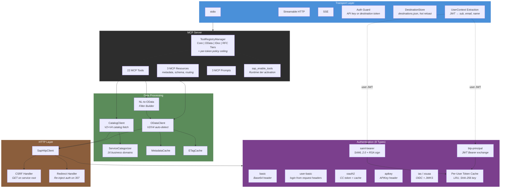
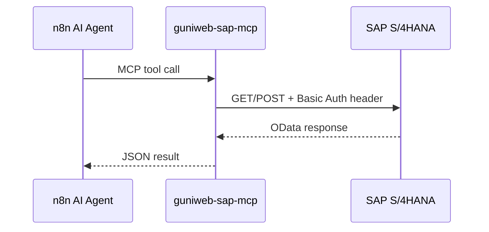
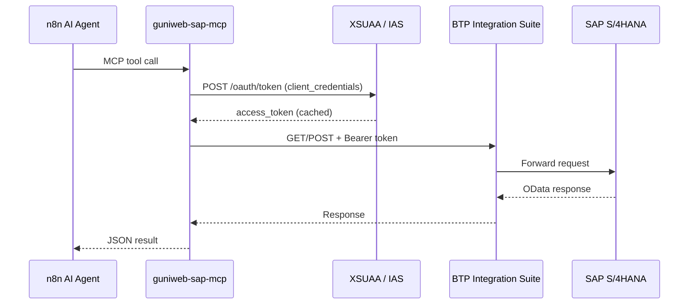
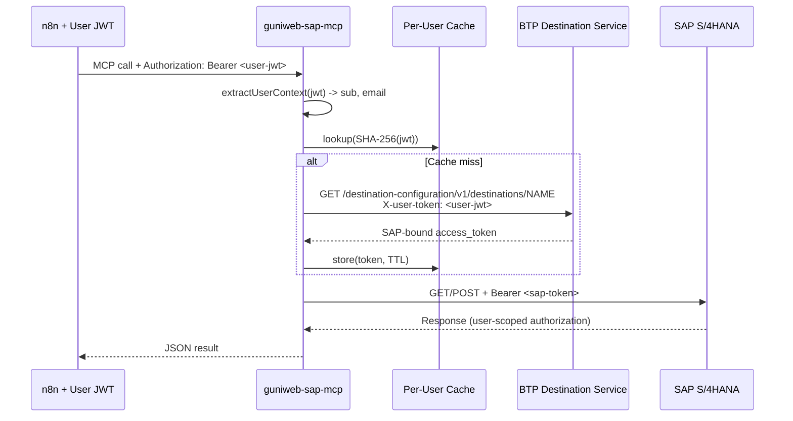
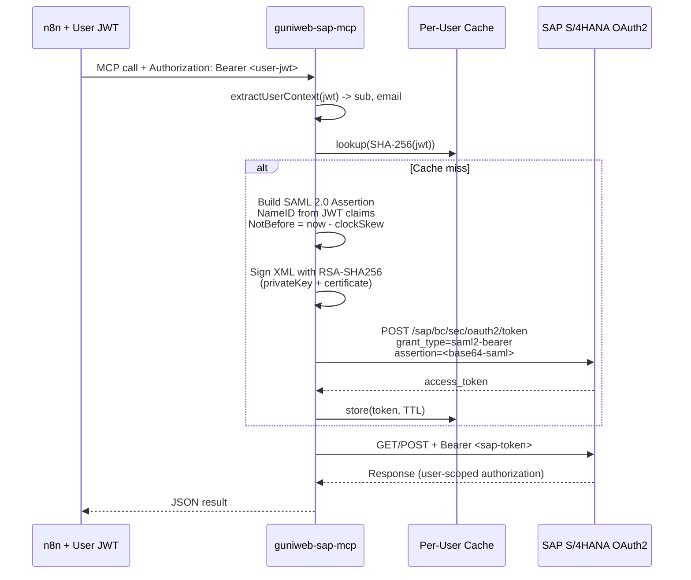
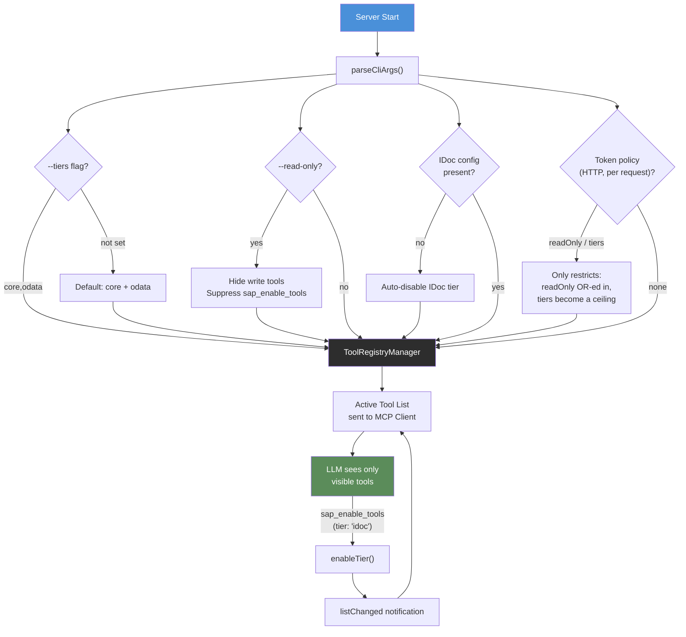
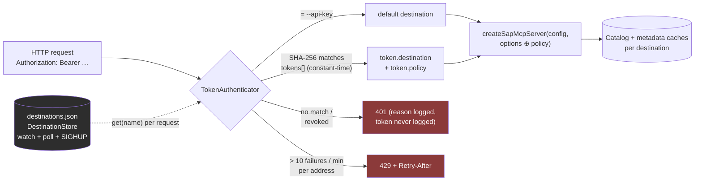
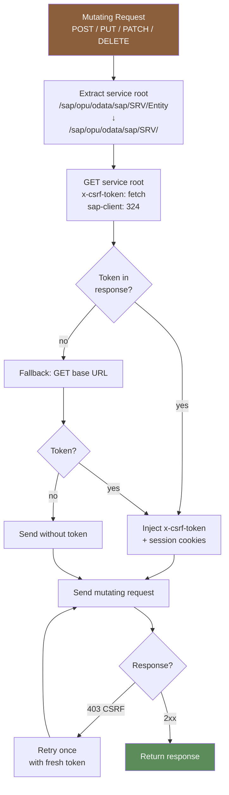
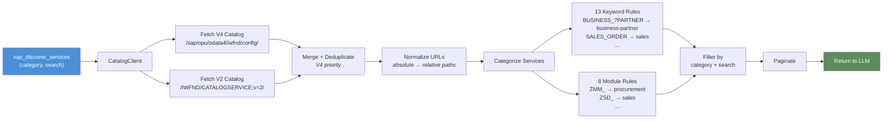
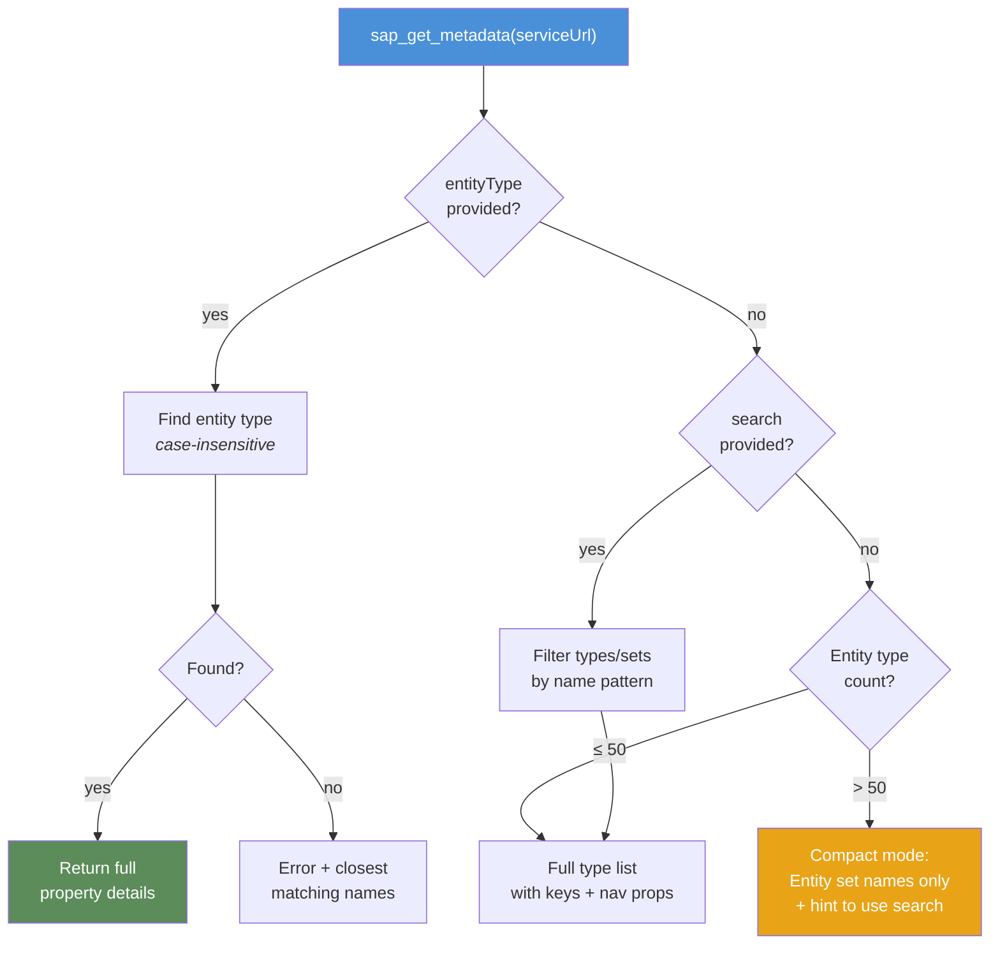

# Architecture

Technical architecture of the SAP S/4HANA MCP Server (`guniweb-sap-mcp`).

## Component Overview



## Integration Paths

### Path 1: Direct S/4HANA



### Path 2: BTP Client Credentials



### Path 3: BTP Principal Propagation



### Path 4: SAML Bearer (Direct, no BTP)



## Tool Visibility System



## Named Destinations and Token-Bound Access (0.3.0)

One server, several SAP systems. In HTTP mode every request is resolved to a destination before a per-request MCP server is created (the Streamable HTTP transport is stateless, so the resolution is cheap and naturally hot-reloadable):



- **`DestinationStore`** (`src/destinations/destination-store.ts`) — loads `destinations.json` (entries share the `SAP_*` zod schema; `${ENV}` placeholders resolved at load), keeps the last valid configuration if a reload fails, watches the directory (atomic replaces change the inode) with a 1 s stat poll as safety net, reloads on `SIGHUP`. Without a file the `SAP_*` environment is the single destination `default`; with a file, `SAP_*` is added as `default` unless the file defines one.
- **`TokenAuthenticator`** (`src/destinations/token-auth.ts`) — compares the presented token's hash against **all** entries without early exit; `--api-key` remains valid alongside. Rate limit per client address.
- **Policy** is applied in the transport (`applyTokenPolicy`) and enforced by the `ToolRegistryManager` (`allowedTiers` ceiling, `readOnly` OR-ed in) — `sap_enable_tools` cannot cross it, and `tools/list` reflects it per request.
- **CLI** (`src/destinations/cli.ts`) — `destinations list|add|remove`, `tokens list|issue|revoke`; validates with the server's parser before writing, writes atomically, prints the plain token exactly once on stdout.

## CSRF Token Flow



## Service Discovery Flow



## Metadata Response Optimization



## Project Structure

```
src/
├── index.ts                    # Entry point, CLI, transport init
├── auth/                       # 8 authentication types (incl. user-basic: personal login per request)
│   ├── types.ts                # SapDestination discriminated union
│   ├── destination-factory.ts  # Creates destination from config
│   ├── oauth2-client.ts        # OAuth2 CC token manager
│   ├── ias-xsuaa-token-manager.ts  # IAS/XSUAA with OIDC discovery
│   ├── btp-principal-token-manager.ts  # BTP JWT Bearer exchange
│   ├── saml-bearer-token-manager.ts    # SAML 2.0 assertion + signing
│   ├── user-context.ts         # UserContext extraction from HTTP headers
│   ├── token-manager.ts        # TokenManager interface
│   └── oidc-discovery.ts       # OIDC/.well-known discovery
├── config/                     # Configuration & CLI
│   ├── types.ts                # Zod schema (all 8 auth types) — also the destination entry schema
│   ├── index.ts                # loadConfig() from env vars
│   ├── cli.ts                  # CLI args + --tiers, --allow-write, --tool-timeout, --destinations
│   └── startup-selftest.ts     # Five-stage self-test + SAP_CLIENT warning, per destination
├── destinations/               # Named destinations, tokens, policy, admin CLI (0.3.0)
│   ├── schema.ts               # destinations.json format, ${ENV} placeholders, token entries
│   ├── destination-store.ts    # Load, hot-reload (watch + poll + SIGHUP), fail-safe
│   ├── token-auth.ts           # Constant-time token lookup, api-key coexistence, rate limit
│   └── cli.ts                  # destinations list|add|remove, tokens list|issue|revoke
├── catalog/                    # Service discovery
│   ├── catalog-client.ts       # V2+V4 catalog fetch + URL normalization
│   ├── catalog-cache.ts        # In-memory catalog cache
│   ├── service-categorizer.ts  # 16 business domain categories
│   └── catalog-errors.ts       # BTP detection + actionable errors
├── nl-query/                   # NL-to-OData conversion
│   ├── filter-builder.ts       # Structured filters -> OData $filter
│   └── types.ts                # StructuredFilter type
├── http/                       # SAP HTTP communication
│   ├── sap-http-client.ts      # CSRF + redirect + per-user auth + abort/budget
│   ├── error-parser.ts         # OData error -> SapError
│   ├── sap-error-explainer.ts  # Failure -> cause + next action (R7/R17)
│   ├── connection-diagnostics.ts # DNS/TLS/auth/client/catalog staging (R9)
│   └── concurrency.ts          # Bounded parallel SAP calls (R5)
├── observability/              # What a tool call did, and how long it may take
│   ├── tool-context.ts         # AsyncLocalStorage: signal, deadline, correlation id
│   └── tool-instrumentation.ts # Time budget + one log line per tool call (R4/R14)
├── odata/                      # OData V2 + V4
│   ├── odata-client.ts         # Unified facade with version detection
│   ├── metadata-cache.ts       # TTL + base-URL key + optional persistence (R12)
│   ├── metadata-store.ts       # Atomic JSON persistence for the caches (R12)
│   ├── v2/                     # V2: GET/POST/MERGE/DELETE
│   ├── v4/                     # V4: GET/POST/PATCH/DELETE
│   └── batch/                  # $batch (multipart + JSON)
├── idoc/                       # IDoc HTTP/XML
│   ├── idoc-client.ts          # Send via POST to /sap/bc/idoc_xml
│   ├── webhook-server.ts       # Receive via HTTP webhook
│   └── ...                     # XML build/parse, validation, metadata
├── rfc/                        # RFC/BAPI via optional node-rfc (SAP NW RFC SDK)
│   ├── rfc-availability.ts     # Import-only detection; tools disabled when absent
│   ├── rfc-config.ts           # SAP_RFC_* (direct or load-balanced, SNC)
│   └── rfc-pool.ts             # Connection pool
├── routing/                    # Domain routing resources for LLM tool selection
├── mcp/                        # MCP protocol layer
│   ├── server.ts               # Server factory + tool registration proxy
│   ├── tools/                  # 22 MCP tools
│   ├── tool-registry.ts        # 4-tier visibility manager + token-policy ceiling
│   ├── resources/              # MCP resources (metadata, schema, routing)
│   └── prompts/                # Pre-built conversation starters
└── transport/                  # HTTP/SSE server
    └── http-server.ts          # Streamable HTTP + SSE, api-key/token auth, per-destination caches
```

## Key Design Decisions

| Decision | Rationale |
|----------|-----------|
| No SAP Cloud SDK runtime | Removed for non-permissive transitive licenses. Custom HTTP + auth layer. |
| Unified OData facade | Single interface hides V2/V4 differences. Lazy version detection. |
| CSRF via GET (not HEAD) | Many SAP Gateways don't return tokens on HEAD requests. |
| Service-specific CSRF URL | Tokens are often service-scoped, not system-wide. |
| `z.string()` for write data | LLMs can't populate `z.record()` (generic `{type: object}`). JSON string works reliably. |
| Catalog URL normalization | SAP catalog returns absolute URLs that break when concatenated with baseUrl. |
| Compact metadata mode | Services with 300+ entity types overflow LLM context windows. |
| IDoc via HTTP/XML | No C++ native RFC bindings. Cross-platform, Docker-friendly. |
| Per-user LRU cache | SHA-256 keying prevents cross-user token leakage in principal propagation. |
| One token = auth + destination | The n8n MCP Client sends exactly one `Authorization` header; a token that both authenticates and selects the system keeps SAP secrets on the server. Header pass-through and credentials-as-tool-arguments were rejected. |
| Policy only restricts | A per-token policy can never widen what the server allows (`--allow-write`, `--tiers`) — the operator's baseline stays the upper bound. |
| Hot reload never replaces a valid config with an invalid one | A typo in `destinations.json` must not take a running server down; the error is logged, the last valid configuration stays. |

## Testing

- **1267 tests** -- unit, integration, E2E
- Unit tests run without SAP access (mocked HTTP)
- Integration/E2E require SAP API Business Hub Sandbox
- CI: unit on every push, integration on master
